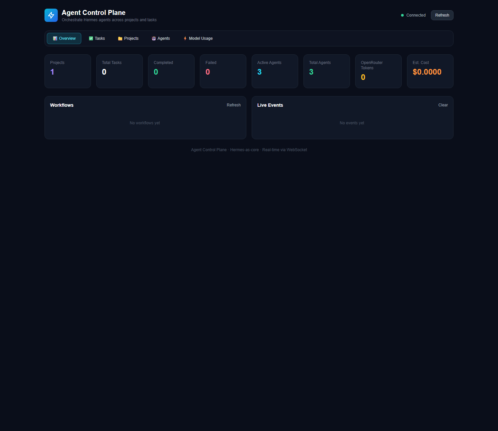

# Agent Control Plane

A modular, customizable control plane for AI agents with support for multi-agent systems, workflow orchestration, and plugin extensibility. The execution core is **Hermes Agent** — control-plane "agents" are real Hermes processes with full tool access, persistent memory, and skills.

## Features

- **Runs on Hermes** — agents are spawned `hermes` processes (headless, quiet mode); tasks execute through Hermes with full tools, memory, and skills
- **Agent Registry & Lifecycle Management** - Register, initialize, and manage agent lifecycles
- **Task Orchestration** - Submit tasks, create workflows with dependencies, priority-based scheduling
- **Inter-Agent Messaging** - Request/response, pub/sub, event-driven communication
- **Plugin System** - Extend with custom agents, schedulers, messaging transports
- **Configuration Management** - JSON/YAML config with hot-reloading and env var overrides
- **Multi-Agent Workflows** - Coordinate complex multi-step processes across agents
- **Human-view dashboard** - spawn Hermes agents, watch them work, and inspect live Hermes sessions

## Architecture

```
control_plane/
├── core/              # Core interfaces and main ControlPlane class
├── agents/            # Agent registry, lifecycle, and HermesAgent adapter
├── orchestration/     # Task scheduling and workflow engine
├── messaging/         # Message bus, request/response, event bus
├── plugins/           # Plugin manager, capability registry, agent factory
├── config/            # Configuration management
├── web/               # Real-time web dashboard (FastAPI + WebSockets)
└── examples/          # Example agents and usage
```

## Hermes as the Execution Core

An agent defined with `"type": "hermes_agent"` is backed by a real Hermes process. When the control plane dispatches a task to it, the task payload is turned into a prompt and run through `hermes chat -q <prompt> -Q` (headless, quiet mode). Each run captures:

- **Hermes `session_id`** (parsed from stderr) — enables stateful resumption via `--resume`
- **The model's final output** (stdout)
- **Exit code** and completion timestamp

Because sessions persist in Hermes's SQLite store, a Hermes agent you resume later *remembers* context and long-term memory across tasks.

### Spawning Hermes agents programmatically

```python
from control_plane.core.control_plane import ControlPlane
from control_plane.config.manager import AgentConfig, DEFAULT_CONFIG
import asyncio

async def main():
    cp = ControlPlane(DEFAULT_CONFIG)
    await cp.start()
    # Hermes agent that can handle 'research' and 'summarize'
    agent = await cp.create_and_start_agent(AgentConfig(
        name="researcher",
        type="hermes_agent",          # <-- runs on real Hermes
        auto_start=True,
        capabilities=[
            {"name": "research", "description": "Web research"},
            {"name": "summarize", "description": "Summarization"},
        ],
        config={"model": None},        # optional: {"model": "openai/gpt-4o", "provider": "openrouter"}
    ))
    await cp.stop()

asyncio.run(main())
```

You can also spawn a Hermes agent from the dashboard: enter a name + comma-separated capabilities and click **Spawn Agent**. Spawned agents appear in the Agents panel with a `hermes_agent` type and run tasks on Hermes.

## Projects & Tasks

The control plane is organized around **projects** and **tasks**:

- **A project** is a goal you're working toward (e.g. "Ship a marketing site"). It groups tasks and tracks progress as they complete.
- **A task** is a single, concrete piece of work handed to an agent (e.g. "Research current AI trends"). A task has a goal, a required capability (which agent skill must do it), and optionally a `project_id` that links it to a project.

### Defining a task

```python
from control_plane.core.interfaces import Task

task = Task(
    name="Research design trends",
    description="Research current design trends for the homepage",
    required_capability="research",   # must match an agent's capability
    project_id=project.id,            # optional link to a project
    payload={"goal": "Research design trends for the homepage"},
)
task_id = cp.submit_task(task)
```

### Creating a project

```python
project = cp.create_project(
    name="Website Redesign",
    goal="Modernize the marketing site with a new design and CMS",
)
```

### Project progress

`cp.project_progress(project_id)` computes completion from its tasks:

```python
progress = cp.project_progress(project.id)
# {'total': 2, 'completed': 1, 'failed': 0, 'running': 0,
#  'pending': 1, 'progress_pct': 50, 'status': 'running'}
```

### REST API

| Method | Endpoint | Description |
|--------|----------|-------------|
| GET | `/api/projects` | List all projects with progress |
| POST | `/api/projects` | Create a project |
| GET | `/api/projects/{id}` | Project detail + its tasks |
| POST | `/api/tasks` | Create a task (accepts `project_id`) |

## Task Decomposition

A task can **generate subtasks**, either automatically or by having an agent spawn them — and a parent task **completes only once all of its subtasks finish**. Shared substrate: `parent_task_id` linkage, real dependency resolution, and project inheritance.

### Two ways a task produces subtasks

**1. Agent-driven spawn** — a running agent returns a `spawn` list (or a JSON array) in its result/output, and the control plane creates those subtasks automatically:

```python
# A Hermes/planner agent produces a result like this:
result = {
    "output": '[{"name": "Write endpoints", "required_capability": "code_generation"}, {"name": "Tests", "required_capability": "code_review"}]'
}
# When that task completes, the control plane spawns the subtasks.
```

**2. Explicit auto-decompose** — ask the control plane to split a task via a planner agent:

```python
parent = Task(name="Auth system", required_capability="code_generation")
cp.submit_task(parent)
# Ask a planner agent (capability: task_planning) to split it:
await cp.decompose_task(parent, planner_capability="task_planning")
```

The planner's structured output becomes child tasks. Or spawn subtasks directly with a known plan:

```python
subs = cp.spawn_subtasks(parent, [
    {"name": "Design", "required_capability": "design"},
    {"name": "Build", "required_capability": "build"},
])
```

### Aggregation & real dependencies

- Subtasks inherit the parent's `project_id`, so the project's progress reflects them.
- A **parent completes only when every subtask is terminal** (all completed, or if any failed the parent is marked failed with a summary). This is handled by the task-completion callback.
- `_dependencies_met` now uses a live task store: a task whose `dependencies` aren't all `COMPLETED` stays pending (waits) instead of running prematurely.

### Inspect the tree

```python
tree = cp.task_tree(parent.id)
# {"task": <Task>, "children": [{"task": <Task>, "children": [...]}]}
```

### REST API

| Method | Endpoint | Description |
|--------|----------|-------------|
| POST | `/api/tasks/{id}/decompose` | Decompose a task via a planner agent |
| GET | `/api/tasks/{id}/tree` | Return the task and its nested subtasks |

In the dashboard, every standalone task has a **Decompose** button, and subtasks render nested (indented, with a `↳` marker) under their parent.

## Web Dashboard

The control plane ships with a real-time monitoring dashboard built on **FastAPI + WebSockets + HTMX/Alpine.js**. It gives you live visibility into agents, tasks, workflows, and system metrics — no build step required.

### Start the dashboard

```bash
# From the project root
python -m control_plane.web
# Or via uvicorn directly
python -m uvicorn control_plane.web.server:app --port 8080
```

Then open **http://localhost:8080** in your browser.

### Features

- **Live agent registry** — status, type, and capabilities of every registered agent
- **Task board** — submit tasks from the UI, track pending → running → completed in real time
- **Workflow view** — monitor multi-step workflows and their task dependencies
- **System metrics** — total/completed/failed tasks, active agent count
- **WebSocket push** — the dashboard updates in real time as agents work, no page refresh
- **REST API** — full programmatic control (`/api/agents`, `/api/tasks`, `/api/workflows`, `/api/state`, `/api/usage`, ...)
- **Interactive task submission** — create tasks with name + required capability from the UI
- **OpenRouter usage tracking** — the dashboard shows real token & cost usage per model across all tasks
- **Task filtering** — filter the task board by search text, status, and project
- **Project budgets & cost alerts** — set a spend budget per project; the dashboard flags projects at/over budget
- **Auto-refreshing project status** — `Project.status` updates live as tasks transition (pending → running → completed)
- **SQLite persistence** — projects, tasks, and usage survive a restart (stored in `data/control-plane.db`)

### Persistence & budgets

The control plane persists state to a local SQLite database (`data/control-plane.db`) when `persistence_enabled=True` (the default). Projects, tasks (including their `UsageRecord`s), and statuses are written on every change and reloaded on startup, so the dashboard survives restarts:

```python
config = ControlPlaneConfig(data_dir="./data", persistence_enabled=True)
cp = ControlPlane(config)
```

Projects support an optional spend **budget** (`project.budget_usd`). The dashboard shows a per-project cost/budget bar and fires **cost alerts** when a project reaches 80% or exceeds 100% of its budget. API:

| Method | Endpoint | Description |
|--------|----------|-------------|
| POST | `/api/projects/{id}/budget` | Set (or clear) a project's budget |
| GET | `/api/state` | Includes aggregated cost alerts (`alerts`) |

### OpenRouter token / model usage

Because control-plane agents run on **Hermes**, which talks to OpenRouter, the control plane captures usage automatically from the Hermes session store after each task completes. Every task records a `UsageRecord` with:

- **model** (e.g. `deepseek/deepseek-v4-flash-0731`) and **provider** (`openrouter`)
- **input / output / cache-read / cache-write / reasoning tokens**
- **estimated (and actual) cost in USD** + API call count

Aggregated across all tasks via `cp.usage_totals()`:

```python
totals = cp.usage_totals()
# {'total_tokens': 21095, 'input_tokens': 20031, 'output_tokens': 40,
#  'cache_read_tokens': 1024, ..., 'total_cost_usd': 0.002844,
#  'by_model': {'deepseek/deepseek-v4-flash-0731': 21095}, ...}
```

The dashboard shows a live **⚡ OpenRouter Usage** panel (total tokens, input/output/cache, estimated cost, per-model breakdown) updated in real time via WebSocket. A `GET /api/usage` endpoint returns the same aggregate. Per-task usage is included in `GET /api/tasks/{id}`.

No API key is stored or required by the control plane — usage is read from the Hermes session store that OpenRouter-backed Hermes agents already populate.

### Screenshot



> A static HTML mockup is also available at [`docs/dashboard-mockup.html`](docs/dashboard-mockup.html).

### API endpoints

| Method | Endpoint | Description |
|--------|----------|-------------|
| GET | `/` | Dashboard UI |
| GET | `/api/state` | Full snapshot (agents, tasks, workflows, metrics) |
| GET | `/api/agents` | List all registered agents |
| POST | `/api/agents/{id}/shutdown` | Stop an agent |
| GET | `/api/tasks` | List all tasks |
| POST | `/api/tasks` | Submit a new task |
| POST | `/api/tasks/{id}/cancel` | Cancel a task |
| GET | `/api/workflows` | List all workflows |
| POST | `/api/workflows` | Create a workflow |
| GET | `/api/metrics` | System metrics |
| WS | `/ws` | Real-time WebSocket event stream |

## Quick Start

```python
import asyncio
from control_plane import ControlPlane, DEFAULT_CONFIG, Task

async def main():
    async with ControlPlane(DEFAULT_CONFIG) as cp:
        # Submit a task
        task = Task(
            name="Research AI trends",
            required_capability="research",
            payload={"topic": "AI agents 2024"}
        )
        task_id = cp.submit_task(task)
        
        # Wait for result
        await asyncio.sleep(2)
        result = cp.get_task(task_id)
        print(result.result)

asyncio.run(main())
```

## Configuration

Create a `config.json`:

```json
{
  "name": "my-control-plane",
  "agents": [
    {
      "type": "research_agent",
      "name": "researcher",
      "capabilities": [
        {"name": "research", "description": "Web research"}
      ],
      "config": {"model": "gpt-4", "temperature": 0.3}
    }
  ]
}
```

Load it:

```python
from control_plane import ControlPlane, ControlPlaneConfig

config = ControlPlaneConfig.from_file("config.json")
cp = ControlPlane(config)
```

## Built-in Agent Types

- **ResearchAgent** - Web research, summarization
- **CoderAgent** - Code generation, code review
- **PlannerAgent** - Task planning, workflow design

## Creating Custom Agents

```python
from control_plane import Agent, AgentInfo, AgentCapability, Task

class MyAgent(Agent):
    async def initialize(self):
        # Setup connections, load models
        pass
    
    async def execute_task(self, task: Task) -> dict:
        # Implement task logic
        return {"result": "done"}
    
    async def shutdown(self):
        # Cleanup
        pass

# Register with factory
cp.agent_factory.register_agent_type("my_agent", MyAgent)
```

## Plugin System

```python
from control_plane import AgentPlugin

class MyPlugin(AgentPlugin):
    @property
    def name(self) -> str:
        return "my-plugin"
    
    @property
    def version(self) -> str:
        return "1.0.0"
    
    async def on_load(self, control_plane):
        # Register custom agents, schedulers, etc.
        control_plane.agent_factory.register_agent_type("custom", CustomAgent)
    
    async def on_unload(self):
        pass

# Load plugin
await cp.plugin_manager.load_plugin(MyPlugin)
```

## Messaging Patterns

```python
# Request/Response
response = await cp.request(
    sender_id="me",
    recipient_id="agent-id",
    payload={"action": "process", "data": "..."}
)

# Publish/Subscribe
await cp.message_bus.subscribe("agent-id", handler)

# Events
cp.event_bus.subscribe("task.completed", handler)
await cp.event_bus.emit("task.completed", {"task_id": "..."})
```

## Workflows

```python
from control_plane import Task, TaskStatus

tasks = [
    Task(name="Step 1", required_capability="research", payload={}),
    Task(name="Step 2", required_capability="code_generation", 
         payload={}, dependencies=[tasks[0].id]),
    Task(name="Step 3", required_capability="code_review",
         payload={}, dependencies=[tasks[1].id])
]

workflow = cp.submit_workflow("My Workflow", tasks)
```

## Running Examples

```bash
# Install dependencies
pip install -r requirements.txt

# Run full example
python -m examples.full_example

# Run with custom config
python -c "
import asyncio
from control_plane import ControlPlane, ControlPlaneConfig
config = ControlPlaneConfig.from_file('config.json')
asyncio.run(ControlPlane(config).start())
"
```

## Extending the Control Plane

### Custom Scheduler
```python
from control_plane.orchestration import TaskScheduler

class PriorityScheduler(TaskScheduler):
    async def _find_best_agent(self, task):
        # Custom agent selection logic
        pass

cp.orchestration.scheduler = PriorityScheduler(cp.registry, cp.lifecycle)
```

### Custom Message Transport
```python
from control_plane.messaging import MessageBus

class RedisMessageBus(MessageBus):
    async def send(self, message):
        # Send via Redis pub/sub
        pass

cp.message_bus = RedisMessageBus()
```

## License

MIT